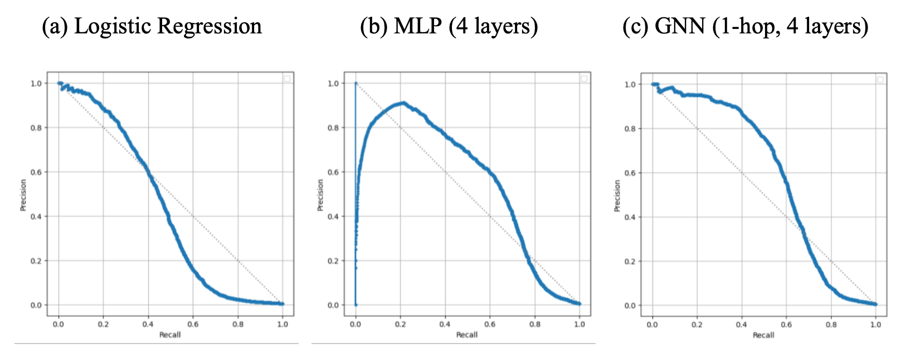
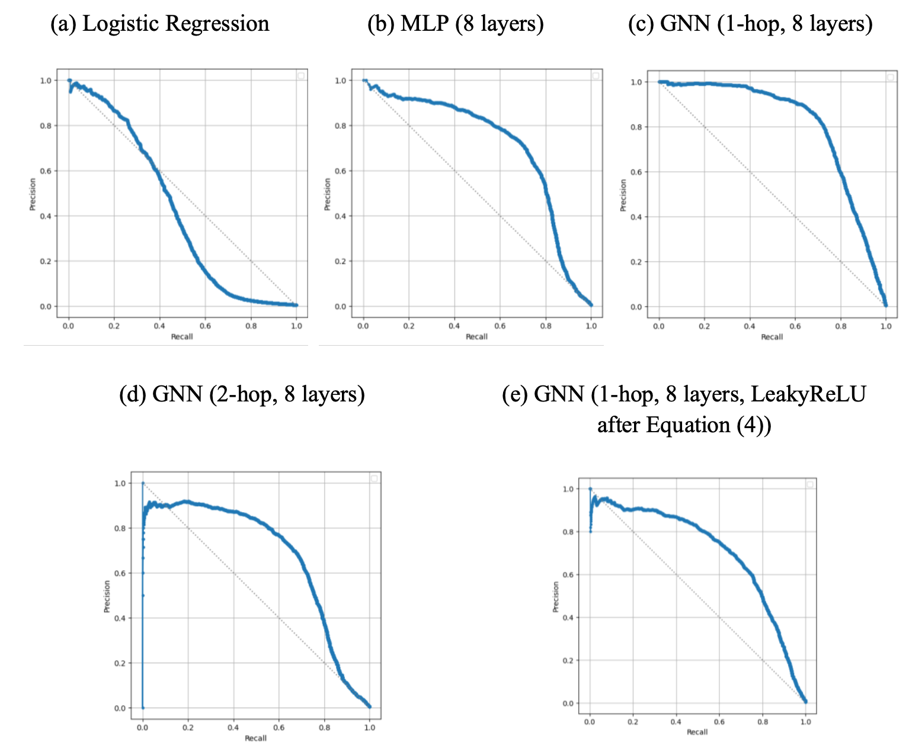
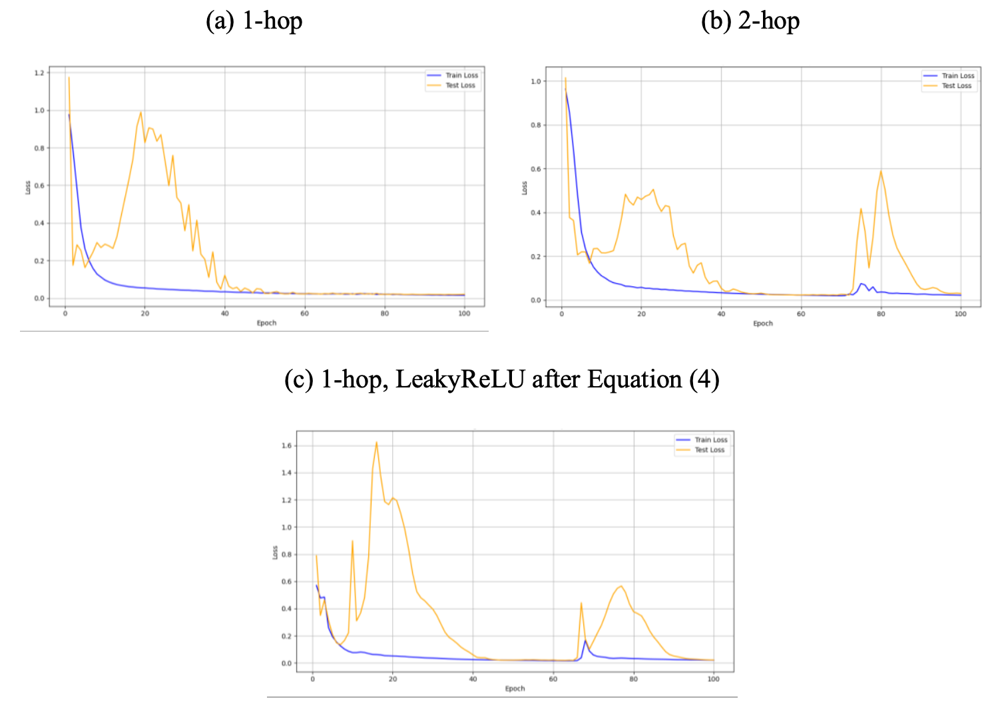
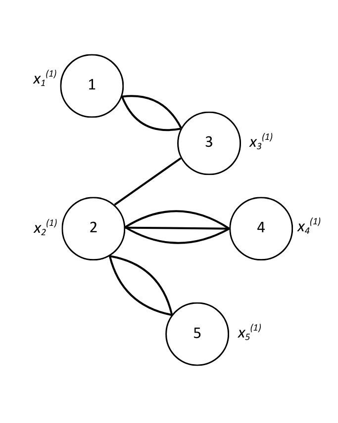
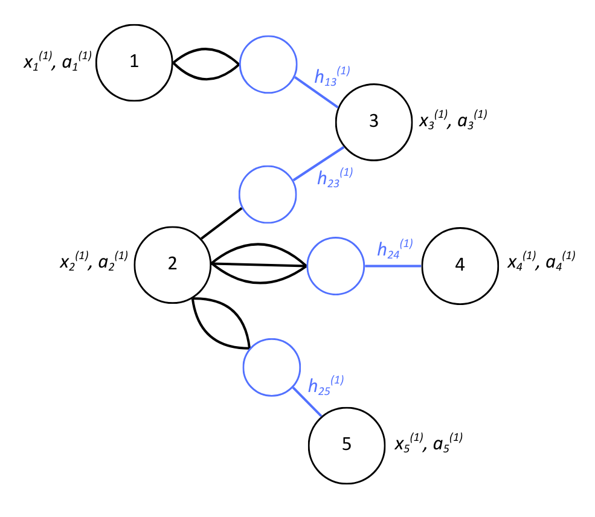

# 💳 Credit Card Fraud Detection

## 📌 Project Overview

This project explores the use of Graph Neural Networks (GNNs) for financial fraud detection by modelling credit card transactions as a multi-edge bipartite graph of customers and merchants. Unlike traditional models that treat transactions independently, the GNN leverages the relational structure in the data to capture complex behavioural patterns.

In this project, the GNN performance is evaluated against Logistic Regression and a Multi-Layer Perceptron (MLP) baseline, with GNNs achieving superior results in F1-score and PR-AUC.

The dataset, sourced from Kaggle ([link](https://www.kaggle.com/datasets/kartik2112/fraud-detection)), includes:

- Training set: 1.3M transactions (Jan 2019–Jun 2020), 0.58% fraud rate, 983 customers, 693 merchants
- Test set: 556K transactions (Jun–Dec 2020), 0.39% fraud rate, 924 customers (some new), same 693 merchants

Merchants are consistent across both sets, while some customers appear only in the test set — suggesting that fraud is more likely to originate from the customer side.

## 🎯 Objectives

- Model transactional relationships using GNNs to capture patterns in customer–merchant interactions.
- Engineer meaningful node and edge features (e.g. transaction frequency, distance, job category).
- Apply statistical methods (ANOVA) to validate feature relevance.
- Compare baseline models (Logistic Regression, MLP) with GNN performance.

## 🔧 Feature Engineering Highlights

- Created categorical job groupings using LLM (DeepSeek) → reduced 494 unique jobs into 13 categories.
- Cyclical time encoding: Extracted hour and day from transaction timestamps and applied sine/cosine transformations to preserve their periodic nature.
- Indicator variable: Created a binary feature for transactions between 10 PM and 3 AM, a window where fraud rates were observed to be significantly higher.
- Temporal features: transaction counts in last 24h, 7 days, 30 days.
- Applied z-score normalisation to features: transaction amount (log), node degree, number of past transactions with merchant, customer age, and transaction frequency.

## 💡 Key Insights

- Time-based patterns revealed that fraud rates spike between 10 PM and 3 AM.
- Fraudulent transactions tend to have higher amounts (coefficient ≈ 1.4 in regression model).
- Spending behaviour varies significantly across merchant categories (coefficients ranging from 0.2 to 1.6).
- Customers involved in fraudulent transactions tend to have fewer overall connections (lower node degrees) compared to those making legitimate transactions.
- Statistical tests (ANOVA) confirmed the significance of the fraud indicator, job categories, and merchant categories.
- The GNN outperformed traditional models by leveraging graph structure and relational features.

## 📊 Model Evaluation & Visual Insights

1. **Model Performance:**

**Table 1: Results based on threshold of 0.5.**

| Model | Recall | Precision | F1-score | PR-AUC |
| --- | --- | --- | --- | --- |
| Logistic Regression | 26.94 | 81.18 | 40.46 | 0.4328 |
| MLP (4 layers) | 32.07 | **82.69** | 46.22 | 0.5548 |
| GNN (1-hop, 4 layers) | **48.76** | 76.69 | **59.62** | **0.5872** |

**Table 2: Results based on threshold of 0.5, and class weight of 5.0 for fraud cases.**

| Model | Recall | Precision | F1-score | PR-AUC |
| --- | --- | --- | --- | --- |
| Logistic Regression | 42.05 | 51.48 | 46.29 | 0.4205 |
| MLP (8 layers) | **90.72** | 10.95 | 19.54 | 0.7108 |
| GNN (1-hop, 8 layers) | 72.59 | **79.85** | **76.04** | **0.8057** |
| GNN (2-hop, 8 layers) | 80.65 | 52.86 | 49.30 | 0.6744 |
| GNN (1-hop, 8 layers, LeakyReLU after Equation (4)) | 79.90 | 49.48 | 61.11 | 0.7046 |

2. **PR-AUC Comparison Across Models**

**PR-AUC for Table 1:**

**PR-AUC for Table 2:**

3. **Training and Test Loss Over Epochs**

**Loss curves for GNNs in Table 2:**

4. **Graph Mechanism Diagrams**

**Multigraph with parallel edges:**

**Artificial nodes (blue) to aid in aggregation of parallel edges:**

## 🧪 Tools Used

- Python (Pandas, Numpy, Seaborn, Matplotlib, Scikit-Learn, Pytorch, Statsmodels, NetworkX, Folium)
- SQL
