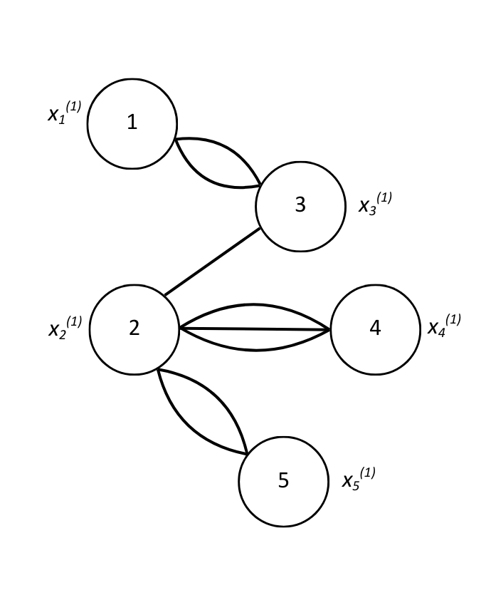
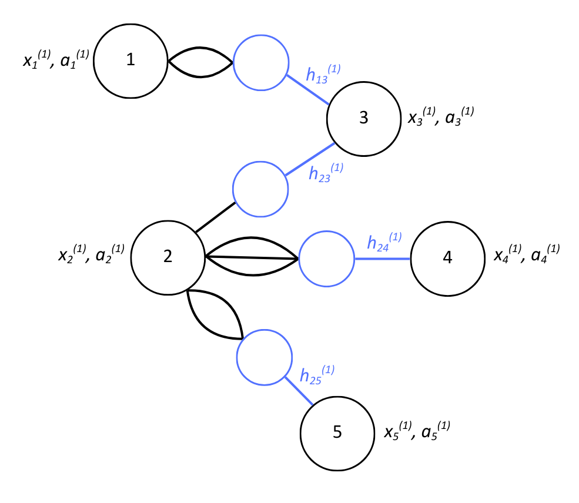
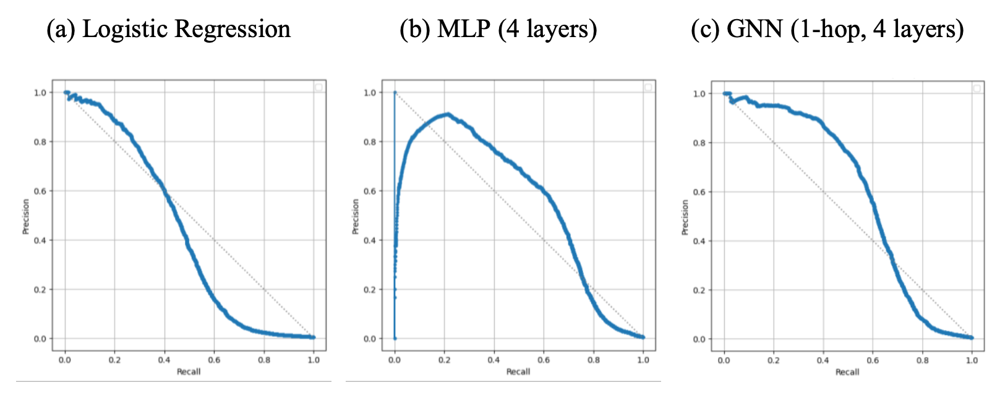
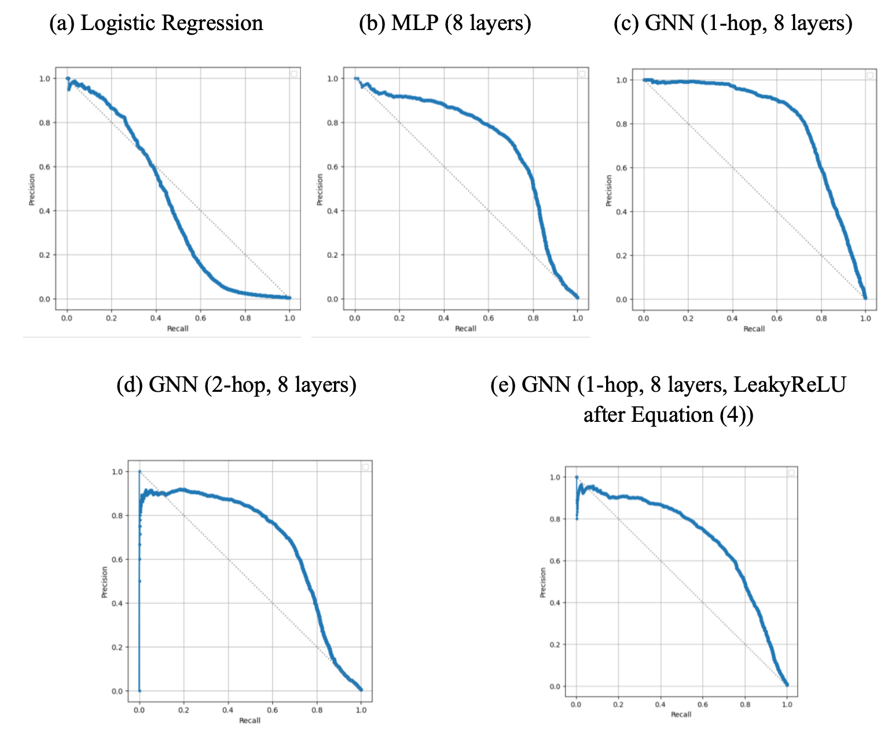
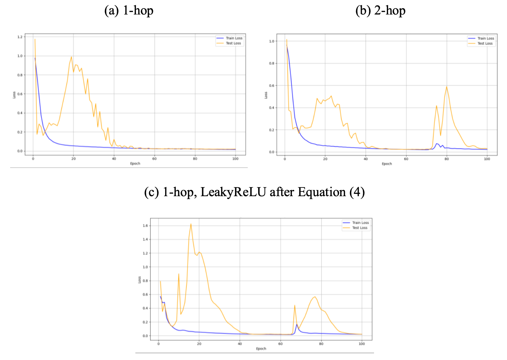

# 💳 Credit Card Fraud Detection

## 📌 Project Overview

This project explores the use of Graph Neural Networks (GNNs) for financial fraud detection by modelling credit card transactions as a multi-edge bipartite graph of customers and merchants. Unlike traditional models that treat transactions independently, the GNN leverages the relational structure in the data to capture complex behavioural patterns.

In this project, the GNN performance is evaluated against Logistic Regression and a Multi-Layer Perceptron (MLP) baseline, with GNNs achieving superior results in F1-score and PR-AUC.

## 🎯 Objectives

- Model transactional relationships using GNNs to capture patterns in customer–merchant interactions.
- Engineer meaningful node and edge features.
- Compare GNN performance with baseline models (Logistic Regression, MLP).

## 🗄️ Dataset

The dataset, sourced from Kaggle ([link](https://www.kaggle.com/datasets/kartik2112/fraud-detection)), includes:

- Training set: 1.3M transactions (Jan 2019–Jun 2020), 0.58% fraud rate, 983 customers, 693 merchants
- Test set: 556K transactions (Jun–Dec 2020), 0.39% fraud rate, 924 customers (some new), same 693 merchants

Merchants are consistent across both sets, while some customers appear only in the test set — suggesting that fraud is more likely to originate from the customer side.

## 🔧 Approach

### Feature Engineering Highlights

- Created categorical job groupings using LLM (DeepSeek) → reduced 494 unique jobs into 13 categories.
- Cyclical time encoding: Extracted hour and day from transaction timestamps and applied sine/cosine transformations to preserve their periodic nature. Reduces dimensionality compared to one-hot encoding of time.
- Indicator variable: Created a binary feature for transactions between 10 PM and 3 AM, a window where fraud rates were observed to be significantly higher during the EDA phase.
- Temporal features: transaction counts in the last 24 hours, 7 days, 30 days.
- Applied z-score normalisation to features to obtain mean 0, standard deviation 1: transaction amount (log), node degree, number of past transactions with merchant, customer age, and transaction frequency.

### Modelling strategy

1. Logistic Regression
    - Simple baseline model
2. Multi-Layer Perceptron (MLP)
    - Adds non-linearity to logistic regression
3. GNN
    - Incorporates transactional relationships into a graph
    - Has node and edge features
    - Uses a message-passing mechanism accounting for multi-edges and neighbouring nodes

      **Multigraph with parallel edges:**

      

      **Artificial nodes (blue) to aid in aggregation of parallel edges:**

      

## 📊 Model Evaluation & Visual Insights

1. **Model Performance:**

| Model | Recall | Precision | F1-score | PR-AUC |
| --- | --- | --- | --- | --- |
| Logistic Regression | 26.94 | 81.18 | 40.46 | 0.4328 |
| MLP (4 layers) | 32.07 | **82.69** | 46.22 | 0.5548 |
| GNN (1-hop, 4 layers) | **48.76** | 76.69 | **59.62** | **0.5872** |

**Table 1:** _Results based on threshold of 0.5._ Introducing non-linearity in the MLP improves all metrics from the simple Logistic Regression, indicating that modelling non-linear decision boundaries is beneficial.

| Model | Recall | Precision | F1-score | PR-AUC |
| --- | --- | --- | --- | --- |
| Logistic Regression | 42.05 | 51.48 | 46.29 | 0.4205 |
| MLP (8 layers) | **90.72** | 10.95 | 19.54 | 0.7108 |
| GNN (1-hop, 8 layers) | 72.59 | **79.85** | **76.04** | **0.8057** |
| GNN (2-hop, 8 layers) | 80.65 | 52.86 | 49.30 | 0.6744 |
| GNN (1-hop, 8 layers, LeakyReLU after Equation (4)) | 79.90 | 49.48 | 61.11 | 0.7046 |

**Table 2:** _Results based on threshold of 0.5, and class weight of 5.0 for fraud cases._

- The application of the weighted loss function increases recall and F1-score substantially for Logistic Regression.
- Increasing depth of the MLP from 4 to 8 layers yields higher recall but struggles to maintain precision.
- The additional linear layers after the graph layers enhance expressiveness, as seen from GNN (1-hop, 8 layers) compared to GNN (1-hop, 4 layers) in Table 1.
- GNN (2-hop, 8 layers) performs better than the 1-hop model in recall at a threshold of 0.5, but worse in precision, F1-score, and PR-AUC, implying that the 2-hop information could be noise or carries irrelevant information.
- Applying LeakyReLU after node aggregation deteriorates the model, which could mean
that feature representations from the encoding and aggregation steps are informative, and clipping negative values to near 0 will lose potentially important information.

2. **PR-AUC Comparison Across Models**



**Figure 1:** _PR-AUC for Table 1._ In (b), a significant drop in precision is seen at low recall values, which occurs at high thresholds. Many transactions are incorrectly flagged as fraudulent (high false positives (FPs)) while true positives (TPs) are not captured.



**Figure 2:** _PR-AUC for Table 2._ In (b), the dip at high recall indicates that although the model captures more fraud cases, it also has more FPs, leading to a drop in precision.

3. **Training and Test Loss Over Epochs**



**Figure 3:** _Loss curves for GNNs in Table 2._ The GNN models did not exhibit signs of overfitting. While test loss fluctuates during the early stages of training (epochs 1-20), both train and test loss decrease by the end of training.

## 🧪 Tools Used

- Python (Pandas, Numpy, Seaborn, Matplotlib, Scikit-Learn, Pytorch, Statsmodels, NetworkX, Folium)
- SQL

## 📁 Files and Structure
```text
📁 images/               → Visuals used in the README
📁 notebooks/            → Jupyter notebooks
├── data_analysis.ipynb    → EDA, feature engineering, visualisations
└── model.ipynb            → Model training and evaluation
📁 sql/                  → SQL scripts
├── data.sql               → SQL script for importing data
├── schema.sql             → Database schema setup
└── query.sql              → Queries
README.md                → Project overview and documentation
```
